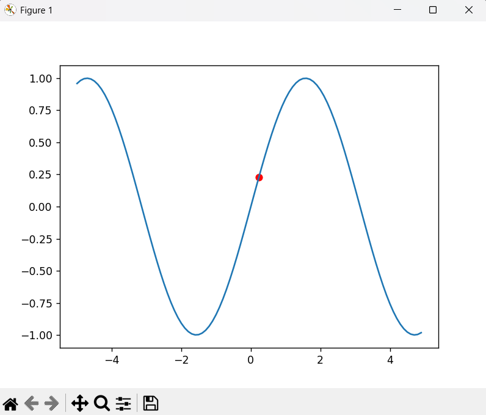
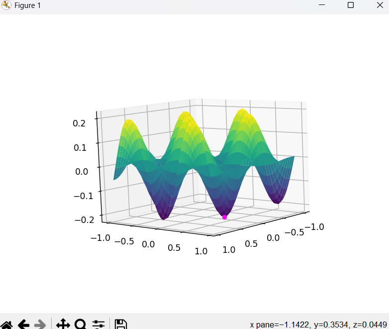

# Gradient Descent Visualization in Python

This repository contains Python scripts demonstrating **gradient descent** on both 1D and 2D functions using `NumPy` and `Matplotlib`. It is intended as a learning exercise for understanding the basics of optimization in **machine learning**.

---

## Files

1. **`gradient_descent_1d.py`**  
   - Demonstrates gradient descent on a 1D function: `y = sin(x)`.
   - Visualizes the iterative steps of the algorithm as a red point moving along the curve toward a local minimum.
   - **Example Output:**



2. **`gradient_descent_2d.py`**  
   - Demonstrates gradient descent on a 2D function: `z = sin(5x) * cos(5y) / 5`.
   - Visualizes the iterative steps of the algorithm on a 3D surface with a magenta point moving toward a local minimum.
   - **Example Output:**



---

## How it Works

- **Gradient Descent** is an optimization algorithm used to find the minimum of a function.
- The basic idea:
  1. Start at an initial point `(x0, y0)`.
  2. Compute the gradient (derivative) at that point.
  3. Move in the opposite direction of the gradient scaled by a learning rate.
  4. Repeat until convergence.

### 1D Function

```python
y = sin(x)
Derivative: dy/dx = cos(x)

The red point shows the current position and moves along the curve toward a minimum.

2D Function
python
Copy code
z = sin(5*x) * cos(5*y) / 5
Gradient:

∂z/∂x = cos(5x) * cos(5y)

∂z/∂y = -sin(5x) * sin(5y)

The magenta point shows the current position moving on the 3D surface toward a minimum.

Requirements
Python 3.x

NumPy

Matplotlib

Install dependencies using pip:

bash
Copy code
pip install numpy matplotlib
Usage
Run the scripts to see the gradient descent in action:

bash
Copy code
python gradient_descent_1d.py
python gradient_descent_2d.py
Watch as the point moves iteratively toward the function's minimum.

Learning Goals
By studying and running this project, you will:

Understand the concept of gradient descent.

Learn how to calculate derivatives and gradients.

Visualize optimization in 1D and 2D spaces.

Build a foundation for more advanced machine learning optimization techniques.


